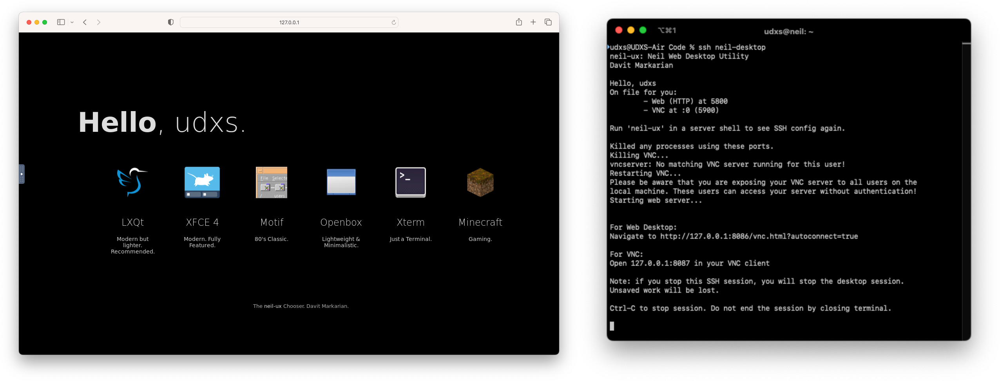

# `neil-ux` and Chooser
## Remote Desktop Initiation Utility

This tool makes it possible to configure remote desktop over SSH, VNC, and HTTP without port conflicts.\
It will:
- allocate VNC/HTTP ports to users
- provide them with simplified SSH forwarding instructions
- prepare a web-based VNC client

Running `neil-ux` will add the user to the database and re-running it will always provide them with their\
SSH configuration instructions.

When configuration is applied to the user's client system, they can run `ssh neil-desktop` to start forwarding.\
This will display the web and VNC ports they can access, as well as instructions for correctly termination the session.

## Neil Chooser
Chooser provides a simple UI that is displayed at desktop startup, enabling selection of different Desktop Environments. This UI is hardcoded with different DEs currently and can be modified as needed.

Chooser will reopen to present options again when a DE is closed but note that closing all applications before closing the DE is required for this to work. This feature is incompatible with XFCE4.

---

## Notes
Developed for use by Team 2MuchCache at San Diego Supercomputer Center for SCC '22.

Do not attempt to install this without adaptation to your environment.\
The file `install.neil` should only be used as a guideline for installation requirements.\
Values are hardcoded so change `uxutility.js` as needed. 

TigerVNC recommended. When using Chooser, modifications to the system-wide `xstartup`
may be necessary if Chooser does not properly reopen after closing a DE. Sessions are not persistent.

**NOTE:** There is no intra-server VNC security. Users can access other running sessions if they
know the correct port number.\
Do **NOT** use in untrusted environments.

---

## Acknowledgements & Licensing

`neil-ux` and Neil Chooser is licensed for use under the Apache 2.0 license. See [LICENSE.md](LICENSE.md).\
Copyright &copy; 2022 Davit Margarian.

Neil Chooser is based on [`neutralinojs-minimal`](https://github.com/neutralinojs/neutralinojs-minimal)
and the [Neutralinojs](https://neutralino.js.org/) runtime.\
Licensed under the MIT License. Copyright &copy; Neutralinojs and contributors.

`neil-ux` is built on Node.js and its dependencies are tabulated below:
###
| Module Identifier     | License | Repository                                         |
| --------------------- | ------- | -------------------------------------------------- |
| death@1.1.0           | MIT     | https://github.com/jprichardson/node-death         |
| get-them-args@1.3.2   | MIT     | https://github.com/tiaanduplessis/get-them-args    |
| graceful-fs@4.2.10    | ISC     | https://github.com/isaacs/node-graceful-fs         |
| kill-port@2.0.1       | MIT     | https://github.com/tiaanduplessis/kill-port        |
| proper-lockfile@4.1.2 | MIT     | https://github.com/moxystudio/node-proper-lockfile |
| retry@0.12.0          | MIT     | https://github.com/tim-kos/node-retry              |
| shell-exec@1.0.2      | MIT     | https://github.com/tiaanduplessis/shell-exec       |
| signal-exit@3.0.7     | ISC     | https://github.com/tapjs/signal-exit               |

[NoVNC](https://github.com/novnc/noVNC) is licensed under the Mozilla Public License 2.0.